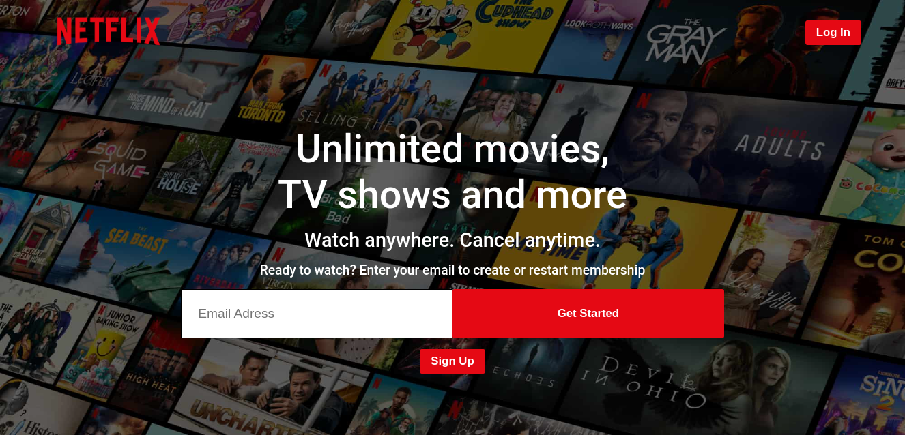
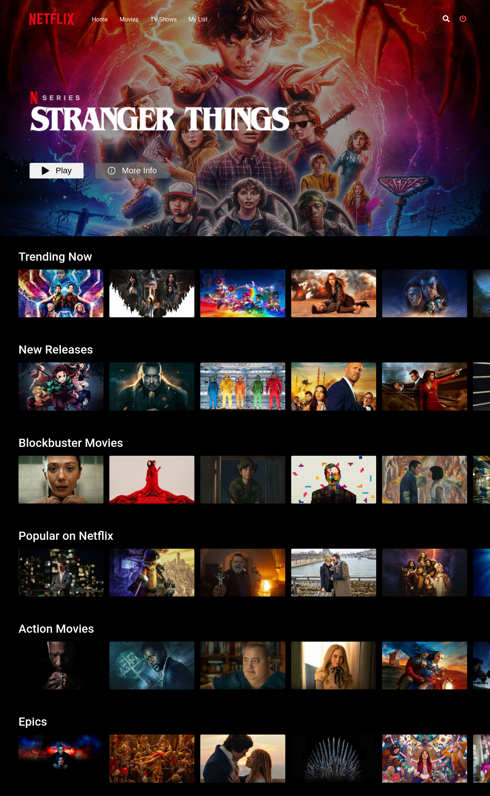
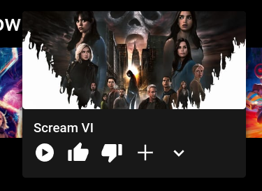

# This Project is Almost Done!!!

## Finished Pages:
- Login Page
- SignUp Page
- Home Page
- Player Page
- Movies Page
- Tv Shows Page
- 404 Page

# Author

|:----------------------------------------------------------------------------------------------------------------------------------------------------------------------------------------------------------------------------------------------------------------------------------------------------------------------------------------------------------------------------------------------------------------------------------------------------------------------------------------------------------------------------------------------------------------------------------:|
|**[Vefa Ayaz](https://ayazvefa.dev)**
|   

# Used Tools:
- JavaScript
- React.js
- HTML
- CSS
- Redux Toolkit
- Styled Components
- react-router-dom
- react-icons
- axios
- firebase
- gh-pages (For deployment React app to github page)

## Login:

# 

## Sign Up:

#

## Home:

#

## Movie Card:

#

[Getting Started with React App](./React.md) 